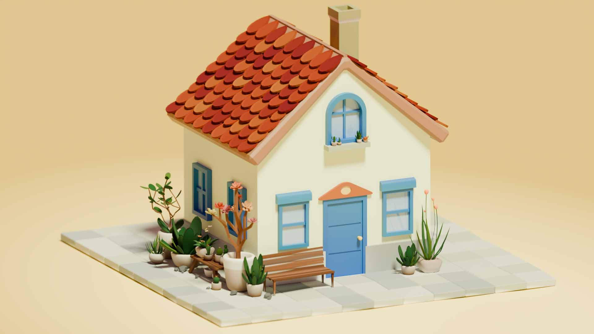

# LuoMenghan_414join
我叫罗梦涵，来自数技24-2班，现在正在做414社团的面试题。 
加入414后，我想要深入学习建模技术，并且希望可以和学长学姐一起参加比赛，也希望运用在414社团的学习到的只是争取实习机会。 
下面是我用Blender制作的小房子建模，我根据房屋设计图制作了初步的模型，并且给各个部分添加了不同材质，比如玻璃和墙面分别运用更光滑和更粗糙的材质，上色完成后利用Cycles渲染引擎进行最终的渲染得到成图。 

